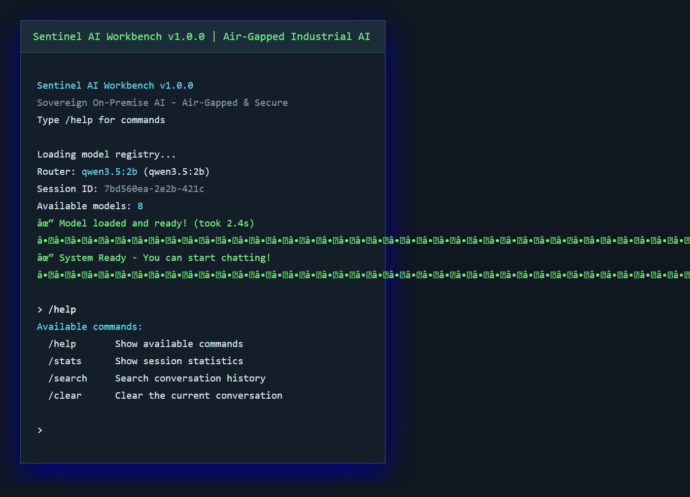
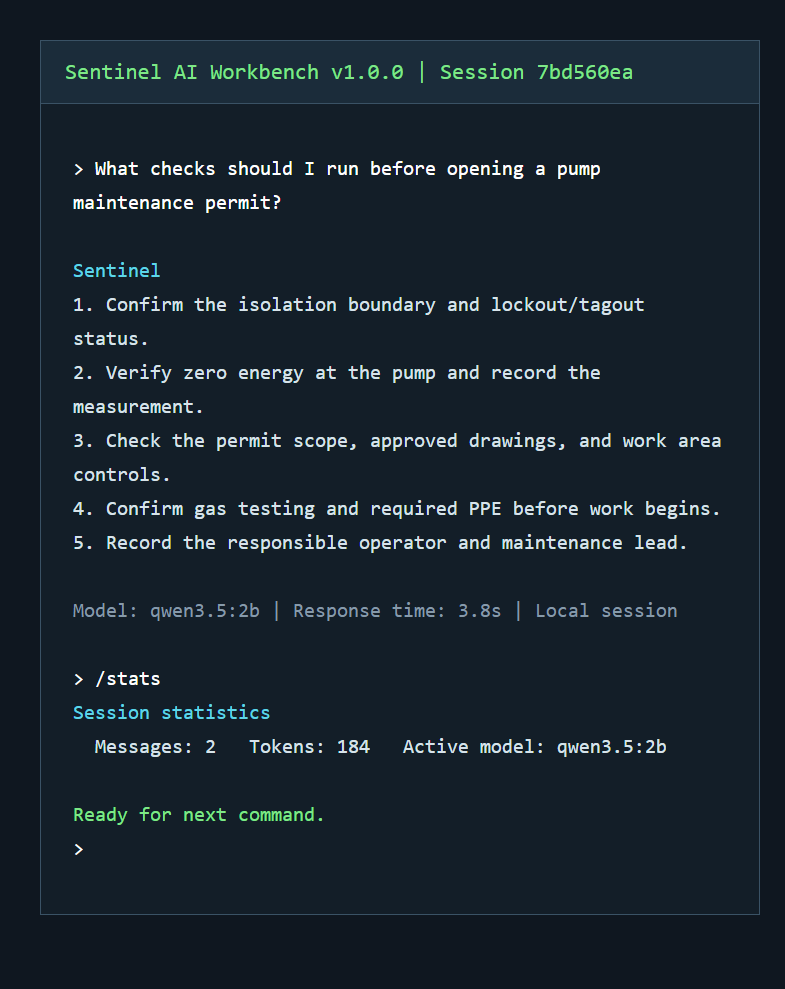

# Sentinel AI Workbench

Sentinel is a sovereign, on-premise agentic AI workbench for industrial environments. It is designed to keep model inference, session state, document processing, and operational tools on local infrastructure, including air-gapped deployments.



## What It Provides

- Local Ollama model backend with configurable router and specialist models
- Textual command-line workbench with streaming responses and slash commands
- SQLite-backed session history with full-text search and usage statistics
- Local tools for documents, spreadsheets, PDFs, geospatial data, vision, RAG, and sandbox execution
- Network guardrails and Docker sandbox support for controlled tool execution
- Textual CLI for checking backend status, model routing, chat, and session state

## Requirements

- Windows 10/11 or a compatible Linux environment
- Python 3.11+
- Ollama running locally
- Docker Desktop for sandboxed execution
- At least 4 GB of GPU RAM recommended

## Quick Start

```powershell
git clone https://github.com/DannySoundarajD/PowerHouse.git
cd PowerHouse

python -m venv venv
.\venv\Scripts\Activate.ps1
pip install -r requirements.txt
copy .env.example .env
```

Start Ollama and pull the configured models:

```powershell
ollama serve
python scripts/pull_models.py
```

Launch the main workbench:

```powershell
python -m src.cli.app
```

The installed console entry point is also available after package installation:

```powershell
sentinel
```

## CLI Session

The primary user experience is the local Textual CLI. It keeps the conversation, model routing, session history, and commands in the terminal:



## Useful Commands

```text
/help       Show available commands
/stats      Show session statistics
/search     Search the current session history
/clear      Clear the current conversation
```

Run the automated tests with:

```powershell
pytest tests/ -v
```

## Project Layout

```text
src/agent/       Agent orchestration and routing
src/cli/         Textual command-line interface
src/models/      Ollama backend and model registry
src/network/     Network access guardrails
src/tools/       Document, vision, RAG, sandbox, and file tools
scripts/         Hardware checks, model setup, and verification
templates/       Optional local validation interface
tests/           Unit and live-system tests
docs/            Quick start and presentation documentation
```

Architecture and workflow diagrams are available in the repository root as Draw.io files:

- `sih_architecture.drawio`
- `sih_full_workflow.drawio`
- `sih_workflow_with_context_summary.drawio`

## Configuration

Copy `.env.example` to `.env` and review the Ollama host, router model, model limits, storage paths, and sandbox settings. Keep `.env` local; it is excluded from Git.

## Security Notes

Sentinel is intended for controlled, local deployments. Review tool permissions, Docker settings, filesystem paths, and network policy before using it with operational data. Do not commit credentials, private model files, databases, logs, or generated output.

## License

Apache License 2.0. See the project metadata in `pyproject.toml` for package information.